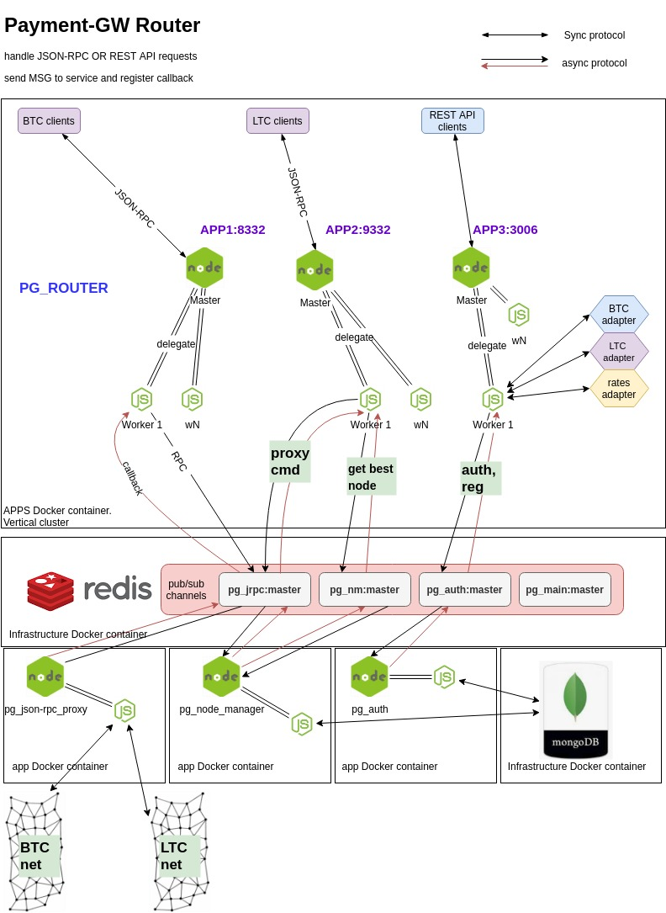

# payment-gateway-router [PGR]
Stateless apps container:
- App1 (HTTP JSON-RPC BTC proxy)
    - BTC main-net JSON-RPC proxy (RPC with pg_jrpc service)(AUTH not required)
    - best node lookup (RPC service - pg_nm)
- App2 (HTTP JSON-RPC LTC proxy)
    - BTC main-net JSON-RPC proxy (RPC with pg_jrpc service)(AUTH not required)
    - best node lookup (RPC service - pg_nm)
- App3 (HTTP REST API)
    - direct proxying to adapters endpoints (AUTH required)
    - AUTH (RPC service)
    - reg user (RPC service)
    - helpers proxy (AUTH not required)
        
## Architecture

### PGR components
- pgr_stack (infrastructure containers)
    - pg_mongo (pgr data store)
    - pg_mongo-express (pgr UI db management console)
    - pg_redis (in memory async RPC APP interaction middleware)
- pgr_stack (APP containers)
    - pg_router (payment gateway node.js router - core)
    - pg_auth (stateless async AUTH micro service)
    - pg_json_rpc_proxy (stateless async JSON-RPC proxy micro service)
    - pg_nm (stateless async node management micro service)
        - BTC/LTC node manager
        - scheduler
        - node checker
        - best node provider
### proxy resources 
- nodes
    - BTC
    - LTC
- services
    - rates (Rates reader API)
    - btc adapter (BTC adapter service)
    - ltc adapter (LTC adapter service)
### PGR Prerequisites
- [Node.js](https://nodejs.org/) v8+ to run.
- config.js 
- docker
### Install and Run PGR (legacy)
1. `cp config-example.js config.js`
2. edit config.js (setup env properties)
3. run (docker-compose -f stack.yml up -d)
```sh
$ git clone https://2b1q@bitbucket.org/bankexlab/payment-gateway-router.git
$ cd payment-gateway-router
$ docker-compose -f pg_stack.yml up -d
```
## Usage (legacy)
### new PGR user REST request (legacy)
Lets create a new PGR user
```sh
$ curl -s 'http://localhost:3006/api/v1/user' -X POST -H "Content-Type:application/json" --user myNewUser:myNewPassword -d '{}'
{
  "msg": "new user created successfully",
  "error": null,
  "reg_services": [
    "btc",
    "ltc"
  ],
  "json_rpc_logins": [
    "btc@myNewUser",
    "ltc@myNewUser"
  ],
  "rest_services_login": "myNewUser"
}
```
Ok! Lets try with **BTC**
```sh
$ curl -s 'http://localhost:3006/'  --data-binary $'{\n "jsonrpc": "1.0",\n "method": "getdifficulty",\n "params": []\n}' --user btc@myNewUser:myNewPassword |jq 
{
  "result": 7184404942701.792,
  "error": null,
  "id": null
}
```
Lets try with **LTC**
```sh
$ curl -s 'http://localhost:3006/'  --data-binary $'{\n "jsonrpc": "1.0",\n "method": "getdifficulty",\n "params": []\n}' --user ltc@myNewUser:myNewPassword |jq 
{
  "result": 8068443.399989726,
  "error": null,
  "id": null
}
```
### LTC/BTC/rates services request proxying (legacy)
Lets try ask **rates**
use *user_name:user_password* to GET response from service.
service proxying request patterns:
 - *<PGR>/api/v1/<service_name>/enpoint?param1=val1*
 - *<PGR>/api/v1/<service_name>?param1=val1*
 Available <service_name> ['btc','ltc','rates']
```sh
$ curl -s 'http://localhost:3006/api/v1/rates/all?from=BKX' -X GET  --user alex:123 -d '{}'
{
  "msg": "authorized",
  "serviceUrl": "http://137.117.110.27:8100/api/v1/rates/all?from=BKX",
  "result": {
    "statusCode": 200,
    "statusMessage": "OK",
    "body": {
      "BKX": 1,
      "BTC": 133614.61238656196,
      "ETH": 3960.600136908633,
      "LTC": 990.8825395875197,
      "USD": 28.173283090828228
    }
  }
}

$ curl -s 'http://localhost:3006/api/v1/btc/rates/all?from=BTC' -X GET  --user alex:123 -d '{}'
{
  "msg": "authorized",
  "serviceUrl": "http://137.117.110.27:8100/api/v1/rates/all?from=BTC",
  "result": {
    "statusCode": 200,
    "statusMessage": "OK",
    "body": {
      "BKX": 7.48349664556962e-06,
      "BTC": 1,
      "ETH": 0.02969620253164557,
      "LTC": 0.007425527426160338,
      "USD": 0.0002109704641350211
    }
  }
}
```
### LTC/BTC JSON-RPC node request proxying (legacy)
Use basic cURL json-rpc request to get data from node
node json-rpc request pattern:
`curl -s 'http://pgr_host:pgr_port/'  --data-binary $'{\n "jsonrpc": "1.0",\n "method": "node method",\n "params": []\n}' --user <node_type>@<user_name>:<user_password>`
LTC node json-rpc request:
```sh
$ curl -s 'http://localhost:3006/'  --data-binary $'{\n "jsonrpc": "1.0",\n "method": "getdifficulty",\n "params": []\n}' --user ltc@user7777:www
{"result":8068443.399989726,"error":null,"id":null}
```
BTC node json-rpc request:
```sh
$ curl -s 'http://localhost:3006/'  --data-binary $'{\n "jsonrpc": "1.0",\n "method": "getdifficulty",\n "params": []\n}' --user btc@user7777:www
{"result":7184404942701.792,"error":null,"id":null} 
```
HTTP header 'content-type' could be any -H 'content-type: text/plain;' OR -H 'Content-Type: application/json'
### services API Docs
Use **<PGR>/api/v1/<service>/help** URL pattern to get API ReDoc UI
 
- [api/v1/ltc/help](http://localhost:3006/api/v1/ltc/help)
- [api/v1/btc/help](http://localhost:3006/api/v1/btc/help)
- [api/v1/rates/help](http://localhost:3006/api/v1/rates/help)

### Demo proxying BTC/LTC services & JSON-RPC to BCT/LTC nodes

### Demo service proxying request

### Demo init stack 


